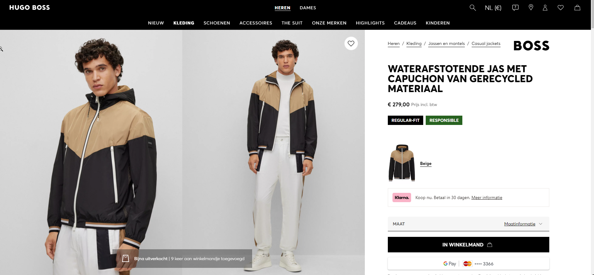

# Dataset Progress

# Gathering data

the initial has now been defined to be items from the Hugo Boss brand. Initially, I will use only upper-body wear (T-shirts, sweaters,…) for males.

 In order to gather this kind of data, I made a scraper for the Hugo Boss website, which can be found here: https://github.com/FelixDeMan/scraper. 

Simply pull the git and cd into the directory.

The scraper has 2 different modes: single product pages and whole categories

### Scraping single product pages

The easiest way to use the scraper, just navigate to one of Hugo Boss’ product pages, such as 



([https://www.hugoboss.com/nl/waterafstotende-jas-met-capuchon-van-gerecycled-materiaal/hbeu50483934_260.html](https://www.hugoboss.com/nl/waterafstotende-jas-met-capuchon-van-gerecycled-materiaal/hbeu50483934_260.html)) 

and run the command:

```bash
python boss_image_scraper.py --url https://www.hugoboss.com/nl/waterafstotende-jas-met-capuchon-van-gerecycled-materiaal/hbeu50483934_260.html
```

The image will be stored in the directory “Hugo_Boss/{category}/{product_name}

Example:

.png)

### Scraping data for a whole category

This process first scrapes the overview of a category page for all the url that link to product pages and saves these into a txt file.

Then the second script can be run in order to download the images for all these urls.

Usage:

```bash
python boss_scrape_categories.py --url https://www.hugoboss.com/nl/heren-riemen/ --filename belts.txt
```

When the browser first opens, you have 5 seconds to click the cookie banner, everything else runs automatically!